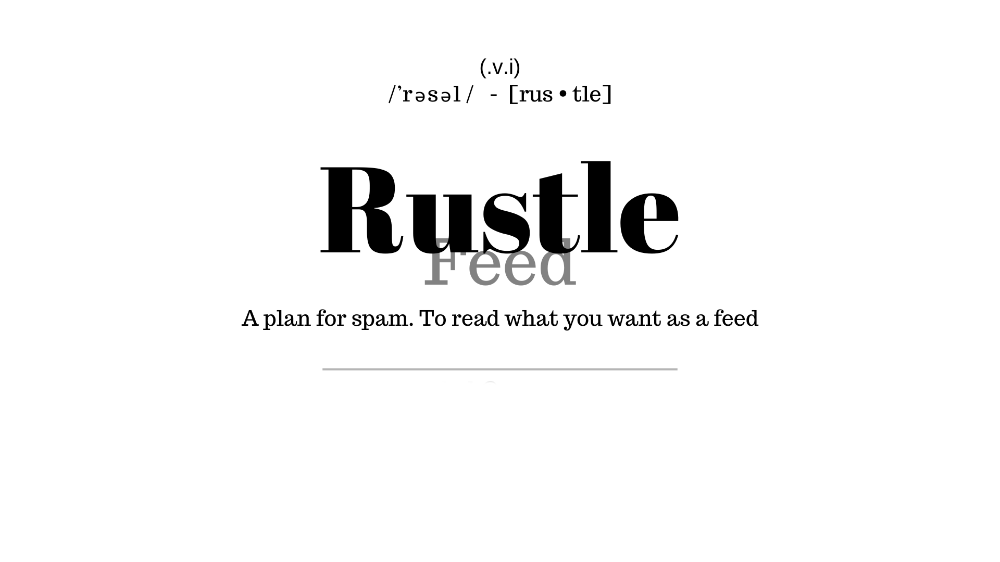

# Rustle feed

Is a feed reader powered by naive bayes classifier to prevent feed spans

## How to run

#### with docker

Create a folder to contain the db:

```shell
  mkdir -p db
```

Create a volume to share a db config with docker, and build the image:

```shell
  docker volume create rustlefeed_db
  docker buildx build -t rustlefeed .
```

To run with configs:

```shell
  docker run -d -p 8000:8000 --name rustlefeed -v rustlefeed_db:/app/db/ rustlefeed:latest
```

To stop:

```shell
  docker stop rustlefeed
```

#### With cargo

Only need the rust components
You can install via [rustup]("https://rustup.rs/")

Enter in directory and run

```shell
  cargo run --release
```
